# Event Booking System Assessment

**Email**: farismuhammed.k2001@gmail.com  
**Reg. No**: 20MIS0218  

**Objective**: Create a basic system that tracks bookings for various events using Node.js, TypeScript, Express.js, and MongoDB.  

### POST /events: Create a new event. The request body should contain the event name, date, and total number of tickets.  

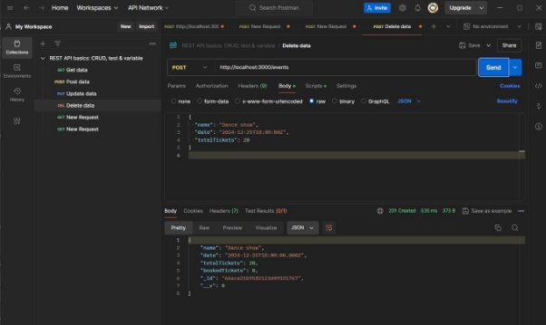  

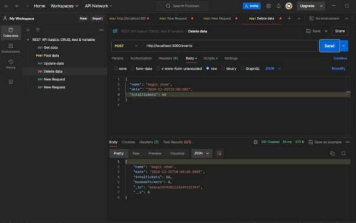  

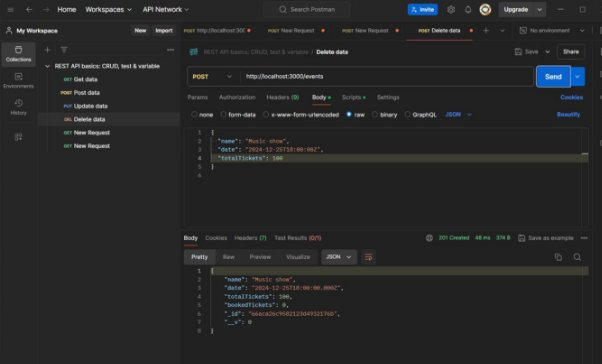  

### POST /bookings: Book tickets for an event. The request body should contain the user ID, quantity, and event ID  

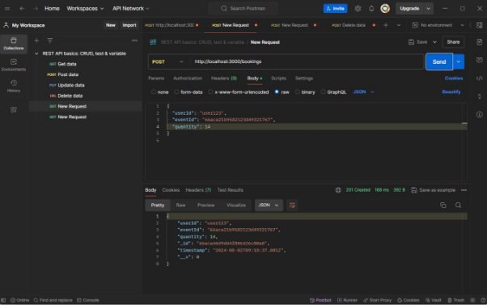  

**Booking Limit**:  
Each user can book a maximum of 15 tickets per booking request. This means that if a user tries to book more than 15 tickets in a single request, the system should only process up to 15 tickets and reject any additional requests in that transaction.  

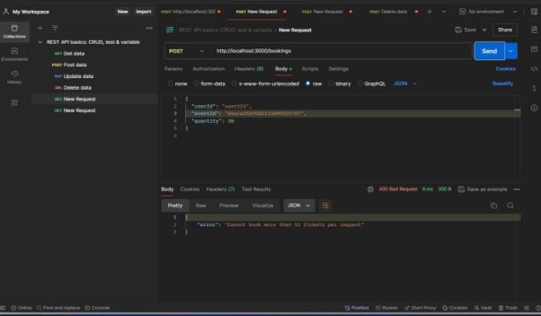  

**Availability Check**:  
- Before confirming the booking, the system must check if there are enough tickets available for the event. If the event has reached its maximum capacity (i.e., no more tickets are available), the system should prevent further bookings and inform the user that the event is fully booked.  
- Adding an event dance show with 50 tickets:  

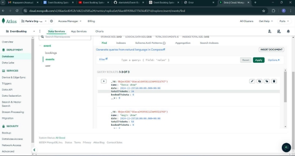  

- User123 book 10 tickets for the show  

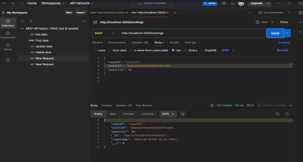  

- User901 book 15 tickets for the show  

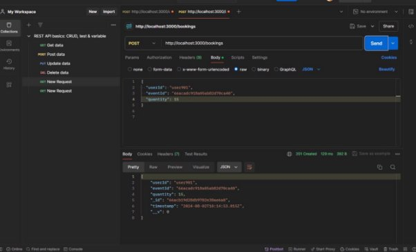  

- User201 cannot book 15 tickets for the show because there are only 5 more tickets  

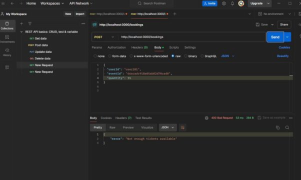  

### DELETE /bookings/:id: Cancel a booking by ID.  

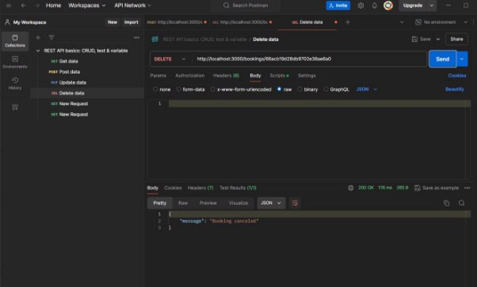  

### GET /events: Retrieve a list of events with available tickets.  

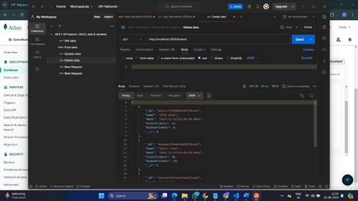  

### GET /events/:id: Retrieve details of a specific event, including booked tickets and remaining tickets.  

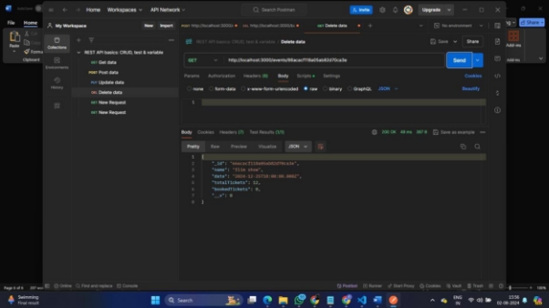  

### POST /print-ticket: This endpoint allows users to print a ticket for a specific booking. It generates a printable format of the ticket, which includes details of the event and booking.  

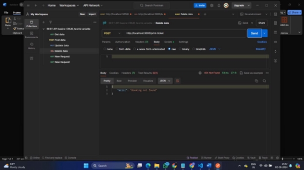  

### VS CODE AND MONGO DB SCREENSHOTS  
  
  

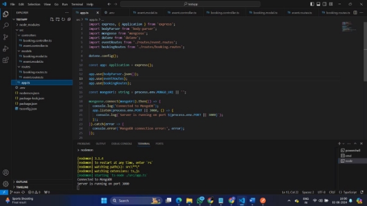  
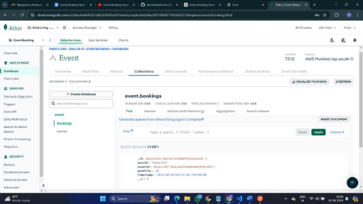  
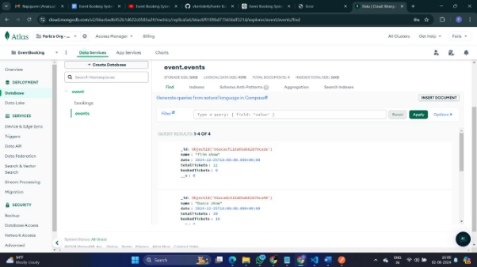  
  
